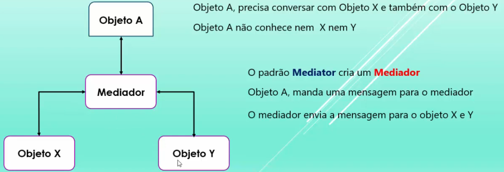

# MediatR

- Based on the mediator pattern which is a behavioral design pattern (GoF). Defined as an object that encapsulates how objects interact. It allows for loose coupling between objects.
- MediatR is a simple in-process messaging library that allows you to send messages between objects in your application. It is a simple and easy way to implement the mediator pattern in your application.
- It is a library that allows you to send a request to a single handler or multiple handlers.
- MediatRScheme:
  

## Installation

- `dotnet add package MediatR`: install the MediatR package.
- `dotnet add package MediatR.Extensions.Microsoft.DependencyInjection`: install the MediatR dependency injection package.
- Register the services in the `Program.cs` file:

```csharp
// Add MediatR to inject the interface IMediator into the controllers and services
builder.Services.AddMediatR(Assembly.GetExecutingAssembly());
```

## Message Types

- **Request/Response**: a message sent to a single handler that returns a response.
- **Notification**: a message sent to multiple handlers.

### Main components

- **Request**: message to be processed and has properties to input data into the handler. Implements the `IRequest` interface.
- **Handler**: class that processes the certain messages. Implements the `IRequestHandler` interface.

## Operation

- **IRequest**: does not return a value.
- **IRequest\<TResponse>**: a request that returns a response of type `TResponse`.
- **IRequestHandler\<TRequest>**: a handler that processes a request of type `TRequest` but does not return a value.
- **IRequestHandler\<TRequest, TResponse>**: a handler that processes a request of type `TRequest` and returns a response of type `TResponse`.
- **IMediator**: allows implementing `Mediator` to interact with the other components.
