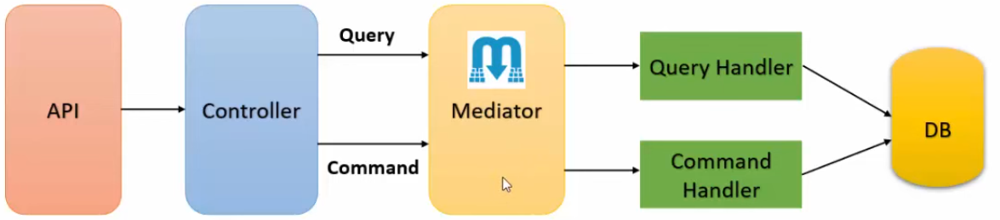

# CQRS (Command Query Responsibility Segregation)

- CQRS is a architectural pattern that separates read and write operations for a data store.
- **Commands**: represents the write operations. They are responsible for changing the state of the system.
- **Queries**: represents the read operations. They are responsible for returning the data, without changing the state of the system.
- Commands are task-based operations that perform an action, while queries are data-based operations that return data.
- Commands can be processed asynchronously, staying in a queue until they are processed.
- Queries return a DTO (Data Transfer Object) that doesn't encapsulate any domain knowledge.
- It can be separated different databases for read and write operations, but it's not mandatory.

## Pros and Cons

- **Pros**:
  - Separation of responsibilities
  - Scalability
  - Simplified queries
  - Security
  - Data schemas optimization
- **Cons**:
  - Complexity of implementation
  - Handling of messages
  - Eventual consistency: data may not be immediately available after a write operation
- When not to use:
  - Domain or business logic is simple
  - UI simple CRUD style and data access operations are sufficient
- When to use:
  - High demand for read and write operations

## Mediator Pattern (MediatR)

- Mediator pattern is used to reduce the coupling between classes that send a request and classes that handle the request.
- When used with CQRS, MediatR helps on the communication between commands, command handlers, queries, and query handlers.
- CQRS and MediatR:
  
